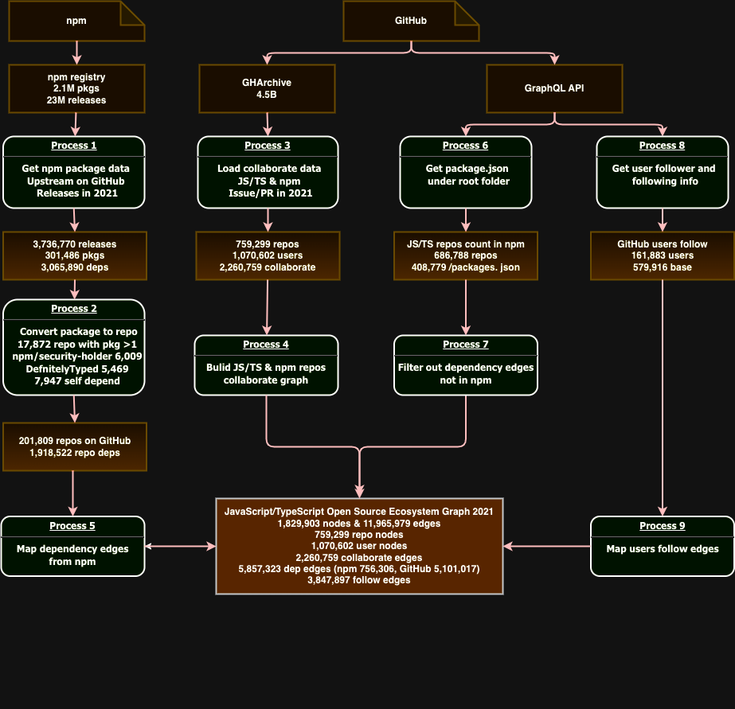

# MSR 2024 NPM OpenRank 补充材料

该仓库包含 NPM 生态数据集及分析的相关补充材料。

## 数据集

原始数据集在 [Zenodo](https://zenodo.org/records/10317762) 上，包含 2021 年全年 NPM 生态中 GitHub 开源仓库的协作网络、依赖网络、开发者社交网络数据。

具体的数据处理流程见下图：

## OpenRank 算法

文件 [openrank_convergence_proof.pdf](openrank_convergence_proof.pdf) 中包含了 OpenRank 算法的收敛性证明。

## 源代码

[src/openrank.ts](src/openrank.ts) 文件包含全域 OpenRank 的计算代码，该代码逻辑会基于上述数据集提供的网络和调研问卷计算出最终的 OpenRank 结果。

### 运行环境

上述数据集和代码需要依赖如下运行环境：

- Neo4j 图数据库社区版 4.3.10 版本。
- Neo4j GDS 1.7.3 版本。
- OpenRank GDS 插件 1.7.3 版本。
- Node.js 14.3.0 版本。

### 运行命令

设置好对应的 Neo4j 数据库地址，使用 `tsc && node src/openrank.js` 命令来运行该代码。
